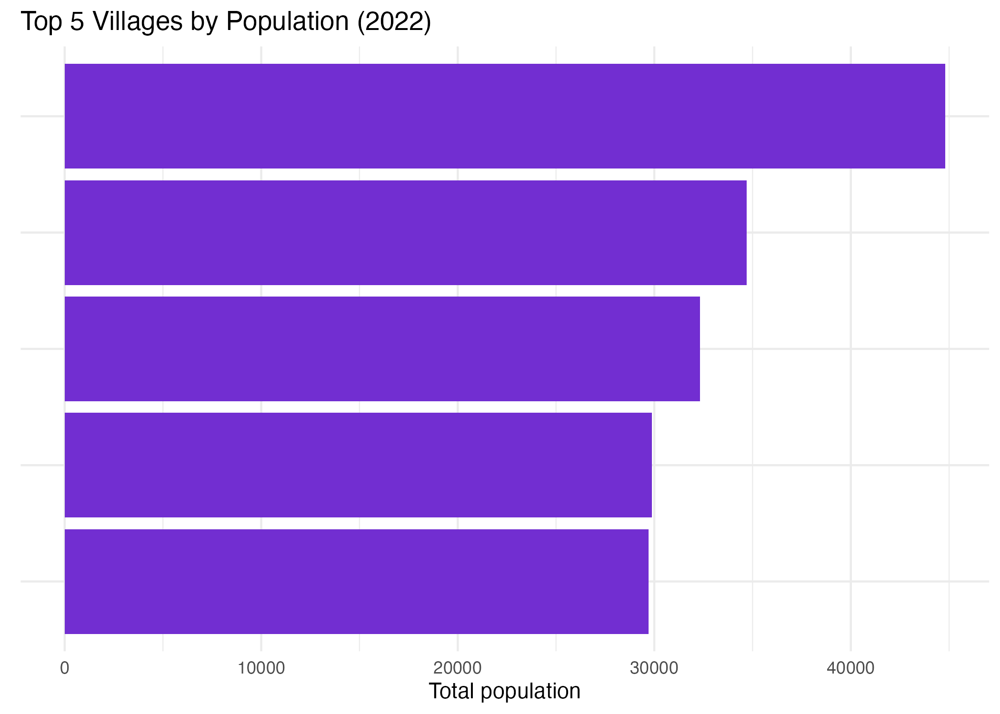
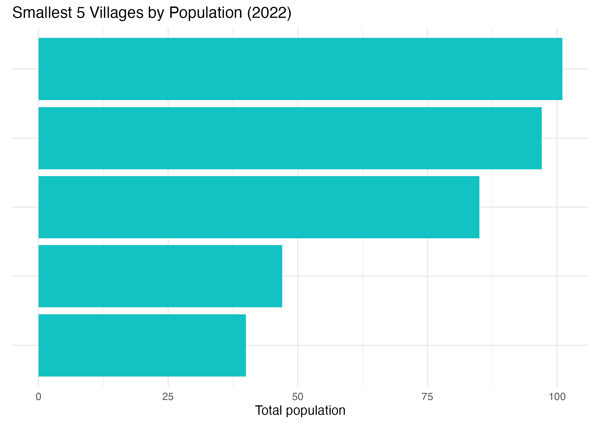

# Village Total Population Summary (2022)

## Dataset
- File: `data/raw/村(里)界(TWD97經緯度)1141031/village_household_population_statistics_2022.csv`
- Population variable: `total_population = 共同生活戶_男 + 共同事業戶_男 + 單獨生活戶_男 + 共同生活戶_女 + 共同事業戶_女 + 單獨生活戶_女`
- Coverage: 7,748 villages (unique `區域別代碼`)

## Distribution (total_population)
- Min: 40
- 25th pct: 1,160
- Median: 2,228
- Mean: 3,003
- 75th pct: 4,192
- Max: 44,797

## Largest 5 Villages
| 區域別代碼 | 區域別 | 村里名稱 | total_population |
|-----------|--------|---------|------------------|
| 64000030044 | 高雄市左營區 | 福山里 | 44,797 |
| 64000030043 | 高雄市左營區 | 菜公里 | 34,710 |
| 64000020016 | 高雄市鼓山區 | 龍水里 | 32,316 |
| 65000170008 | 新北市林口區 | 南勢里 | 29,868 |
| 64000030040 | 高雄市左營區 | 新上里 | 29,704 |

## Smallest 5 Villages (non-zero)
| 區域別代碼 | 區域別 | 村里名稱 | total_population |
|-----------|--------|---------|------------------|
| 10002110007 | 宜蘭縣大同鄉 | 太平村 | 40 |
| 10008130014 | 南投縣仁愛鄉 | 榮興村 | 47 |
| 10015020012 | 花蓮縣鳳林鎮 | 森榮里 | 85 |
| 10016020017 | 澎湖縣湖西鄉 | 太武村 | 97 |
| 09007030003 | 連江縣莒光鄉 | 西坵村 | 101 |

## Notes
- Population is concentrated in urban left bank Kaohsiung (左營/鼓山) and New Taipei (林口).
- Long tail of very small offshore or mountain villages; consider using sqrt or log scale for maps.
- Check for zero-population rows before filtering if needed (none surfaced in smallest non-zero sample above).
